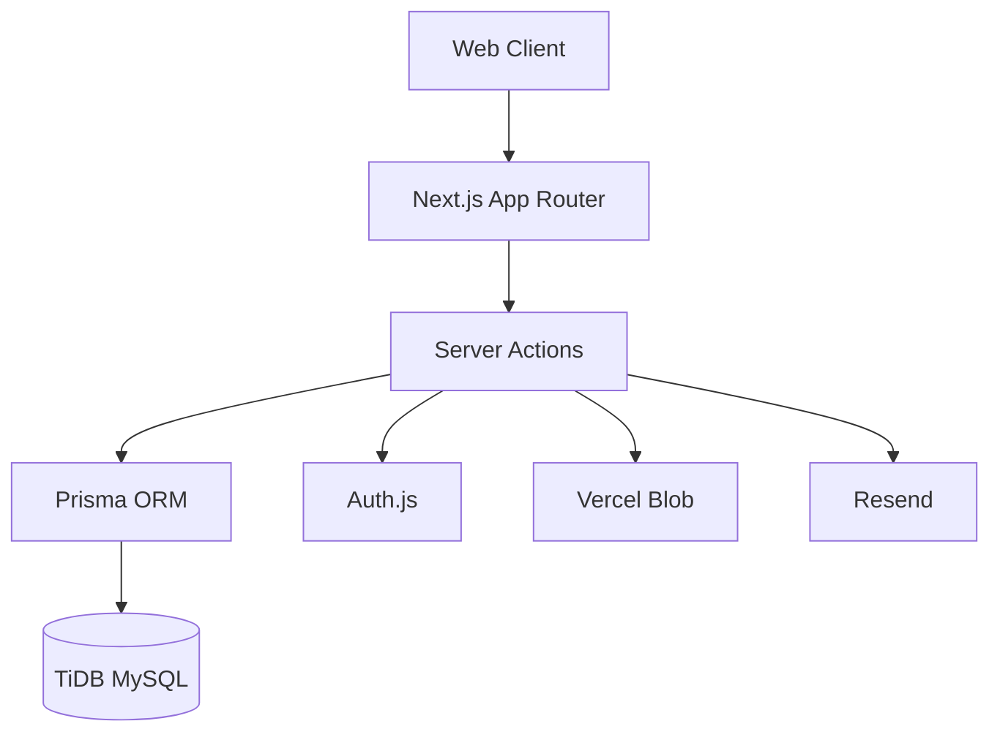

# Pathways

Pathways is a graduation-project web platform for managing cooperative and field training. It streamlines communication and workflow between students, academic supervisors, and field supervisors by providing role-based dashboards, training applications, report submission workflows, and evaluations.

## Screenshots
*(Add screenshots here)*

## Tech Stack
| Component | Technology |
|---|---|
| Framework | Next.js 15.x (App Router, RSC, Server Actions) |
| Language | TypeScript 5 |
| Styling | Tailwind CSS 4 |
| Database | MySQL (TiDB Cloud Serverless) |
| ORM | Prisma 6 |
| Authentication | Auth.js v5 |
| File Storage | Vercel Blob |
| Email | Resend |

## Environment Variables
See `.env.example` for the required structure:
- `DATABASE_URL`
- `AUTH_SECRET`
- `AUTH_URL`
- `BLOB_READ_WRITE_TOKEN`
- `RESEND_API_KEY`
- `EMAIL_FROM`

## Local Setup
1. Clone the repository.
2. Run `pnpm install`
3. Copy `.env.example` to `.env` and fill in values.
4. Run `pnpm prisma migrate dev`
5. Run `pnpm db:seed`
6. Run `pnpm dev` to start the local server on `http://localhost:3000`.

## Scripts
- `pnpm dev`: Start the development server
- `pnpm build`: Build for production
- `pnpm start`: Start the production server
- `pnpm lint`: Run ESLint
- `pnpm typecheck`: Run tsc without emitting files
- `pnpm format:check`: Run Prettier check
- `pnpm db:seed`: Seed the database with sample data

## Architecture

## Deployment Notes
Designed to be deployed on Vercel. Connect the GitHub repository to a Vercel project, add the required environment variables, and deploy. Make sure to run `prisma migrate deploy` against the production database during or after deployment.
